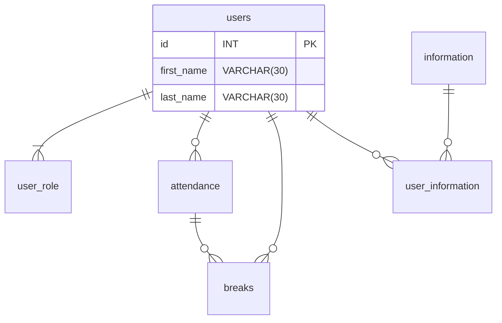
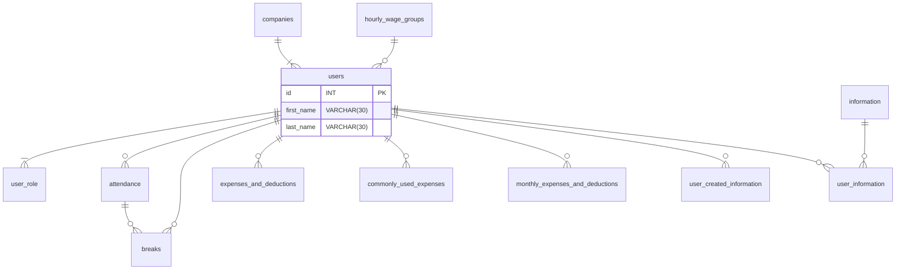

TODO:機能ごとに目次を作ってERDを分ける
全体はテーブル名だけでいい
各ERDのセクションはテーブルの中身も出す

勤怠関係

```mermaid

erDiagram
  users ||--|{ user_role: ""
  users ||--o{ attendance: ""
  users ||--o{ breaks: ""
  users ||--o{ user_information: ""
  information ||--o{ user_information: ""
  attendance ||--o{ breaks: ""

  users{
    id INT PK
    first_name VARCHAR(30) 
    last_name VARCHAR(30) 

  }

```
経費関係
ユーザー関係
アドミン関係
設定関係
計算関連（バッチ）
インフォメーションもしくはその他
全体

```mermaid

erDiagram
  companies ||--|{ users: ""
  hourly_wage_groups ||--o{ users: ""
  users ||--|{ user_role: ""
  users ||--o{ attendance: ""
  users ||--o{ breaks: ""
  users ||--o{ expenses_and_deductions: ""
  users ||--o{ commonly_used_expenses: ""
  users ||--o{ monthly_expenses_and_deductions: ""
  users ||--o{ user_created_information: ""
  users ||--o{ user_information: ""
  information ||--o{ user_information: ""
  attendance ||--o{ breaks: ""


  users{
    id INT PK
    first_name VARCHAR(30) 
    last_name VARCHAR(30) 

  }

```