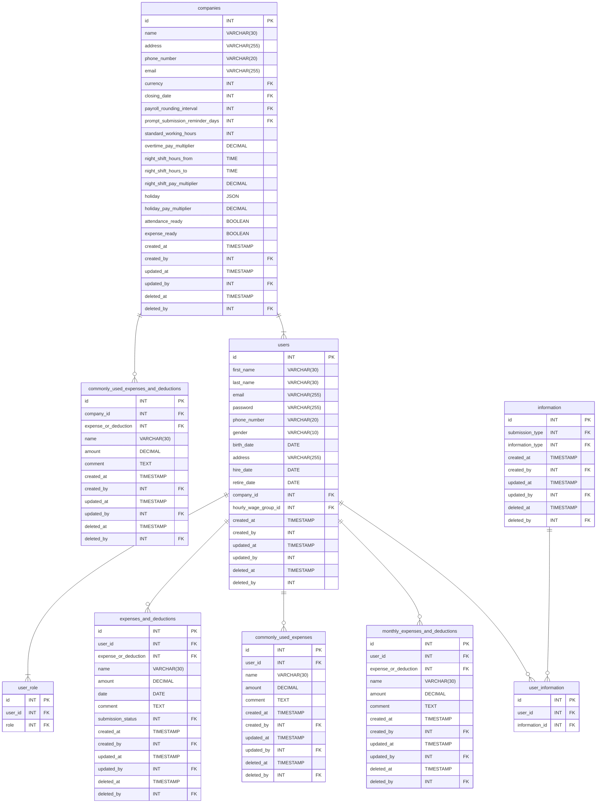

# Entity-Relationship Diagrams<!-- omit in toc -->
- [Attendance Relationship](#attendance-relationship)
- [Expense Relationship](#expense-relationship)
- [User Relationship](#user-relationship)
- [Payroll Calculation Relationship](#payroll-calculation-relationship)
- [Summary Relationship](#summary-relationship)

## Attendance Relationship

## Expense Relationship

## User Relationship

## Payroll Calculation Relationship

## Summary Relationship

