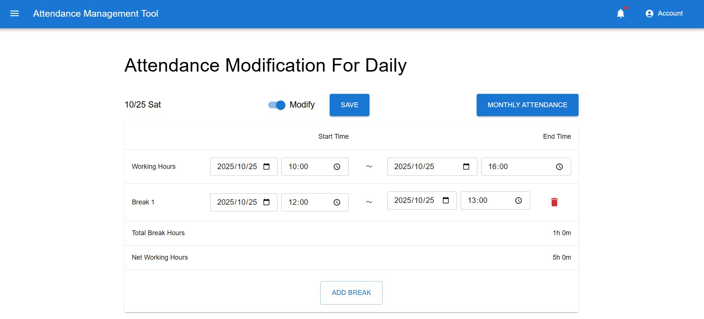
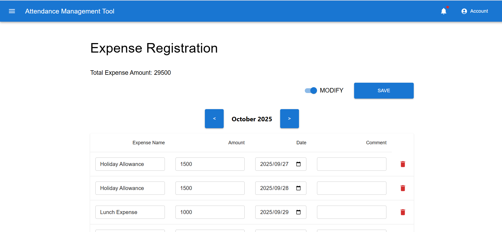
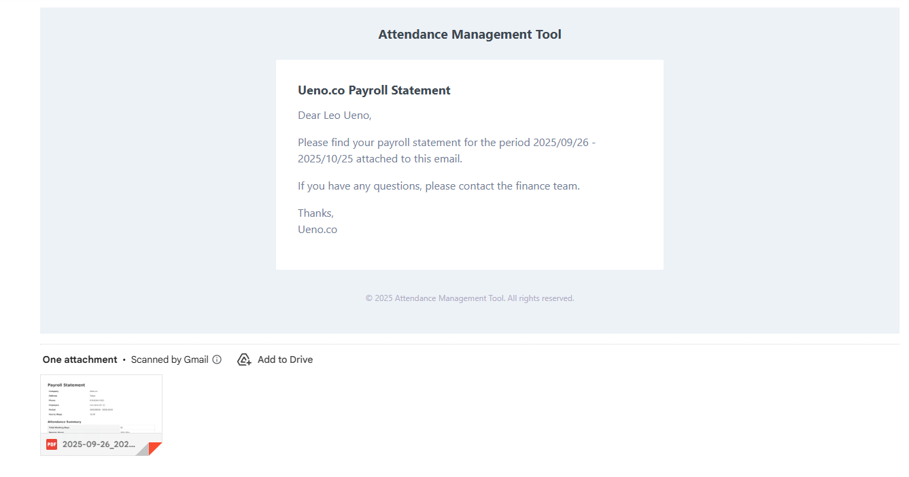
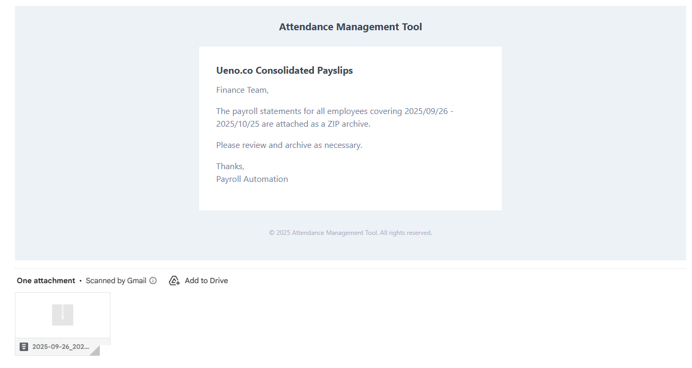

# Project Overview

## Project name
Attendance Manager

## Business case
Manage employee attendance data

## Purposes and Goals
### Purpose
To have employees work in accordance with the law and pay their salaries correctly.
### Goal
Employees can register attendance and expenses in real time or later. 
Managers can handle the data and generate payslips that include calculations based on hourly wages, premium wages, and expenses

## Scope
Employees are expected to work remotely and their work primarily uses computers, registration via the web can be done stress-free. 
Based on these assumptions, we have established the following scope.

| Element                         | In Scope                                                                   | Out Of Scope                                     |
| :------------------------------ | :------------------------------------------------------------------------- | :----------------------------------------------- |
| Registration method             | Web app                                                                    | Other registration methods                       |
| Registration location           | Range that can access the web server                                       | Specific excluded locations or scenarios         |
| Expected users                  | Registered companies and corresponding users                               | Other user groups or scenarios                   |
| Data linkage                    | No                                                                         | Future data linkage or integrations              |
| Closing date                    | 15th / 20th / 25th / end of month                                          | Other date                                       |
| Payroll rounding interval       | 1 min / 5 mins / 15 mins                                                   | Other rounding interval                          |
| prompt submission reminder days | 3 days / 5 days / 1 week                                                   | Other days                                       |
| Breakdown of salary             | Calculation of hourly wages, premium wages, and expenses                   | Different types of payroll calculation and taxes |
| Shift Management                | The company can register the days of the week when the business is closed. | Individual Employee Shift Management             |

## Key Features

### Attendance Registration

Employees can register their attendance data in real-time or later through the web application. The system supports flexible registration methods to accommodate various work patterns.

#### Registration Methods

**1. Real-Time Registration**

Employees can record their work start time, end time, and breaks as they occur during the day.

**2. Daily Modification**

Employees can register or modify attendance records for past dates, allowing for corrections and late entries.

**Key Features:**
- Start time and end time registration
- Break time management (multiple breaks per day)
- Comment field for additional notes
- Date-based validation to prevent registration of closed periods
- Support for both new record creation and existing record modification

**Attendance Registration Screen:**

#### Registration Restrictions

To maintain data integrity for payroll processing, attendance registration is restricted for periods that have been closed:

- If `attendance_ready` is `true`, employees cannot register attendance for dates before or equal to one month after the `last_closing_date`
- Example: If `last_closing_date` is 2025/10/25, attendance cannot be registered for dates up to 2025/11/25
- Dates after the restriction period (e.g., 2025/11/26) can be registered normally

### Expense and Deduction Registration

Employees and managers can register expenses and deductions through the web application. The system supports various expense types and deduction categories.

#### Registration Methods

**1. Employee Registration**

Employees can register their expenses and deductions for reimbursement and payroll calculation.

**2. Manager Registration**

Managers can create expense and deduction records on behalf of employees with `CREATED_BY_MANAGER` status, which does not require employee submission.

**Key Features:**
- Date-based expense/deduction entry
- Amount and description fields
- Category classification (expense or deduction)
- Batch registration support (multiple entries at once)
- Date-based validation to prevent registration of closed periods
- Manager-created records are automatically set to `CREATED_BY_MANAGER` status

**Expense Registration Screen:**

#### Registration Restrictions

Similar to attendance registration, expense registration is restricted for closed periods:

- If `expense_ready` is `true`, expenses cannot be registered for dates before or equal to one month after the `last_closing_date`
- Example: If `last_closing_date` is 2025/10/25, expenses cannot be registered for dates up to 2025/11/25
- Dates after the restriction period (e.g., 2025/11/26) can be registered normally

#### Submission Process

- **Employee-submitted records**: Employees can submit their registered expenses for manager approval
- **Manager-created records**: Records created by managers with `CREATED_BY_MANAGER` status do not require submission and are automatically included in payroll calculations

### Automated Payslip Email Delivery

When the monthly payroll batch process completes successfully, payslips are automatically sent via email to employees and finance management personnel.

#### Email Recipients

**1. Individual Employee Emails**

Each employee receives an email with their personal payslip PDF attached.

- **Recipient**: Employee's registered email address
- **Subject**: `[{Company Name}] {Period} Payroll Statement`
- **Attachment**: Individual payslip PDF file
  - File naming format: `{Period Start}_{Period End}_{Employee Name}_Payslip.pdf`
  - Example: `2025-09-26_2025-10-25_LeoUeno_Payslip.pdf`

**Sample Email (Employee):**

**2. Finance Management Archive Email**

Users with the Finance Management role (role = 2) receive a consolidated email with all employee payslips in a ZIP archive.

- **Recipients**: All users with `role = 2` (Finance Management) in the company
- **Subject**: `[{Company Name}] {Period} Consolidated Payroll Statements`
- **Attachment**: ZIP archive containing all employee payslips
  - File naming format: `{Period Start}_{Period End}_{Company Name}_Payslips.zip`

**Sample Email (Finance Management):**

#### Payslip PDF Content

The payslip PDF includes comprehensive payroll information:

- **Company Information**: Company name, address, phone number
- **Employee Information**: Employee name, employee number
- **Pay Period**: Start date and end date (YYYY/MM/DD format)
- **Attendance Summary**:
  - Total working days
  - Total working hours (in "Xh Ym" format)
  - Regular hours
  - Overtime hours
  - Night shift hours
  - Holiday hours
- **Salary Details**:
  - Hourly wage
  - Base pay
  - Overtime pay
  - Night shift pay
  - Holiday pay
  - Salary subtotal (Base Pay + all allowances)
- **Expenses**: Total expenses for the period
- **Deductions**: Total deductions for the period
- **Total Compensation**:
  - Gross Pay (Before Deductions)
  - Net Pay (Gross Pay - Deductions)

**Sample Payslip PDF:**

[View Sample Payslip PDF](Payslip/2025-09-26_2025-10-25_LeoUeno_Payslip.pdf)

#### Email Delivery Process

1. **Payroll Calculation**: The batch calculates payroll for each employee based on:
   - Attendance records (regular, overtime, night shift, holiday hours)
   - Expense records
   - Deduction records
   - Company settings (hourly wage groups, multipliers, rounding)

2. **PDF Generation**: Individual payslip PDFs are generated for each employee

3. **Email Sending**:
   - Individual emails are sent to each employee with their payslip attached
   - A ZIP archive is created containing all payslips
   - The archive is sent to all Finance Management users

4. **Status Update**: After successful email delivery:
   - Attendance records: `submission_status` is updated to `CALCULATED (5)`
   - Expense records: `submission_status` is updated to `CALCULATED (5)`
   - Company: `last_closing_date` is updated to the processing date
   - Company: `attendance_ready` and `expense_ready` are set to `false`

#### Error Handling

- **Individual Employee Errors**: If an email fails to send for a specific employee, that employee is skipped, and the error is logged. Processing continues for other employees.
- **Company-Wide Errors**: If a critical error occurs (e.g., ZIP creation failure), the entire company's processing is rolled back, and administrators are notified.