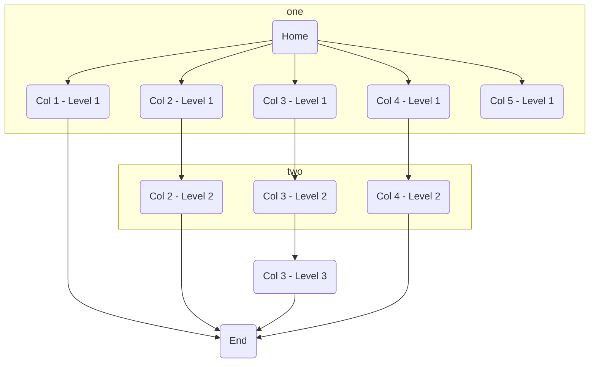

# Project Overview

## Project name
Attendance Manager

## Business case
Manage employee attendance data

## Purposes and Goals
### Purpose
To have employees work in accordance with the law and pay their salaries correctly.
### Goal
Employees can register attendance and expenses in real time or later. 
Managers can handle the data and generate payslips that include calculations based on hourly wages, premium wages, and expenses

## Scope
Employees are expected to work remotely and their work primarily uses computers, registration via the web can be done stress-free. 
Based on these assumptions, we have established the following scope.

| Element                         | In Scope                                                                   | Out Of Scope                                     |
| :------------------------------ | :------------------------------------------------------------------------- | :----------------------------------------------- |
| Registration method             | Web app                                                                    | Other registration methods                       |
| Registration location           | Range that can access the web server                                       | Specific excluded locations or scenarios         |
| Expected users                  | Registered companies and corresponding users                               | Other user groups or scenarios                   |
| Data linkage                    | No                                                                         | Future data linkage or integrations              |
| Closing date                    | 15th / 20th / 25th / end of month                                          | Other date                                       |
| Payroll rounding interval       | 1 min / 5 mins / 15 mins                                                   | Other rounding interval                          |
| prompt submission reminder days | 3 days / 5 days / 1 week                                                   | Other days                                       |
| Breakdown of salary             | Calculation of hourly wages, premium wages, and expenses                   | Different types of payroll calculation and taxes |
| Shift Management                | The company can register the days of the week when the business is closed. | Individual Employee Shift Management             |TODO:検討中

| TH1 | TH2 |
----|---- 
| TD1 | TD3 |
| TD2 | TD4 |