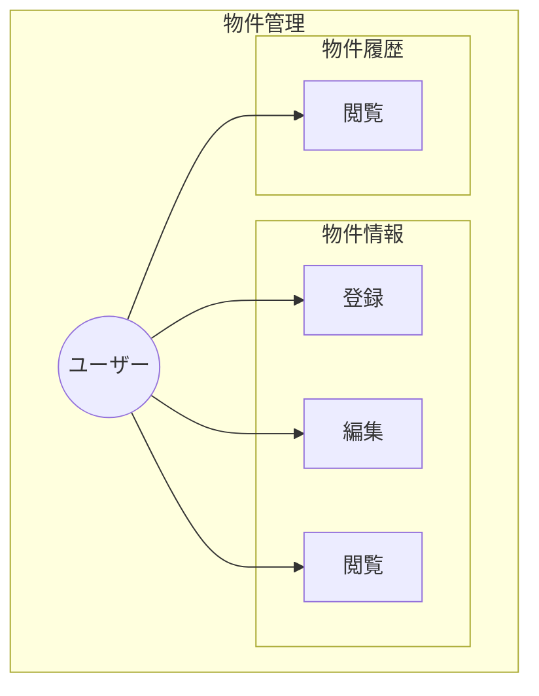
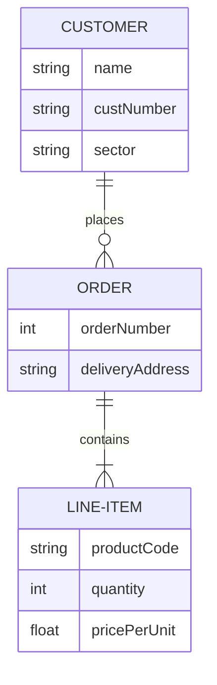

table of contents
//目次を作って各ドキュメントに飛べるようにリンクを付ける

#従業員の操作
* 従業員は登録できる

```mermaid
graph TB
    subgraph "物件管理"
        User((ユーザー))
        subgraph "物件情報"
            AddPropertyInfo[登録]
            EditPropertyInfo[編集]
            ViewPropertyDetails[閲覧]
        end
        subgraph "物件履歴"
            ViewPropertyHistory[閲覧]
        end
    end
    User --> AddPropertyInfo
    User --> EditPropertyInfo
    User --> ViewPropertyDetails
    User --> ViewPropertyHistory

```
管理者は～～

```mermaid
graph TB
    subgraph "物件管理"
        User((ユーザー))
        subgraph "物件情報"
            AddPropertyInfo[登録]
            EditPropertyInfo[編集]
            ViewPropertyDetails[閲覧]
        end
        subgraph "物件履歴"
            ViewPropertyHistory[閲覧]
        end
    end
    User --> AddPropertyInfo
    User --> EditPropertyInfo
    User --> ViewPropertyDetails
    User --> ViewPropertyHistory

```

```mermaid
erDiagram
    CUSTOMER ||--o{ ORDER : places
    CUSTOMER {
        string name
        string custNumber
        string sector
    }
    ORDER ||--|{ LINE-ITEM : contains
    ORDER {
        int orderNumber
        string deliveryAddress
    }
    LINE-ITEM {
        string productCode
        int quantity
        float pricePerUnit
    }
```