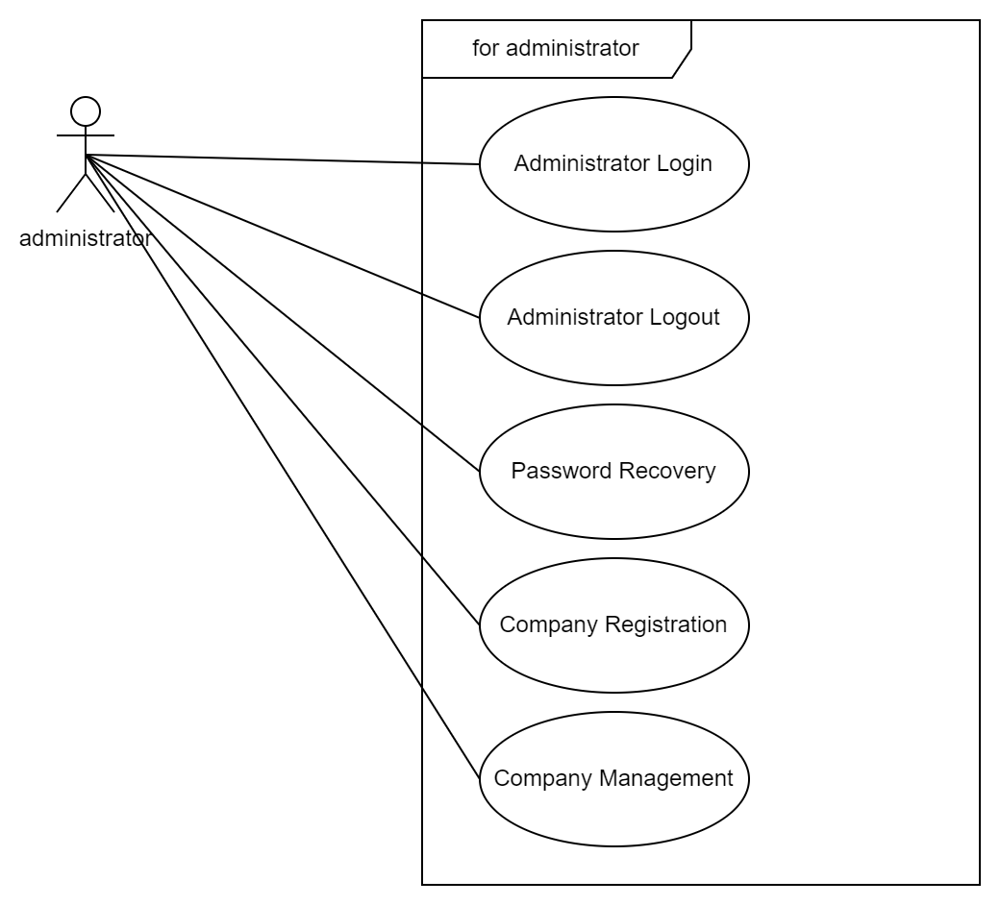
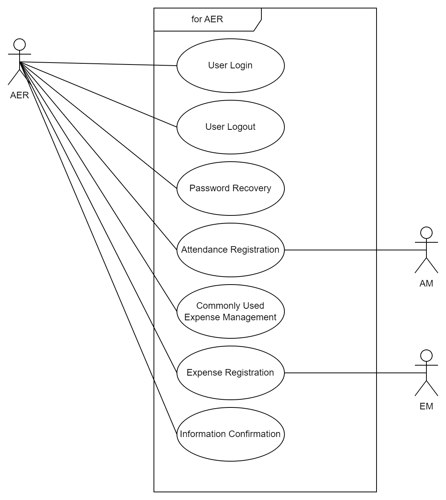
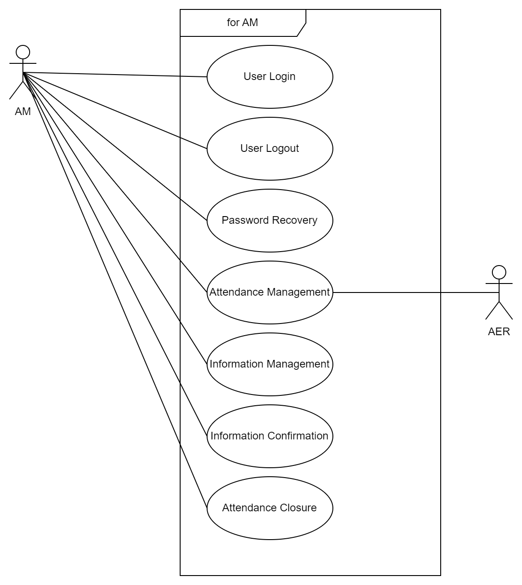
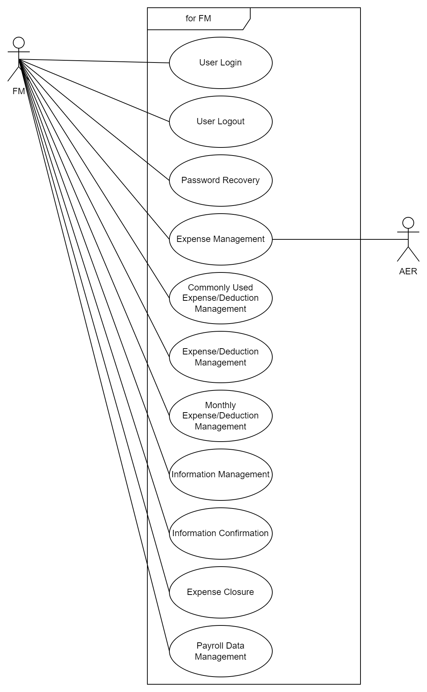
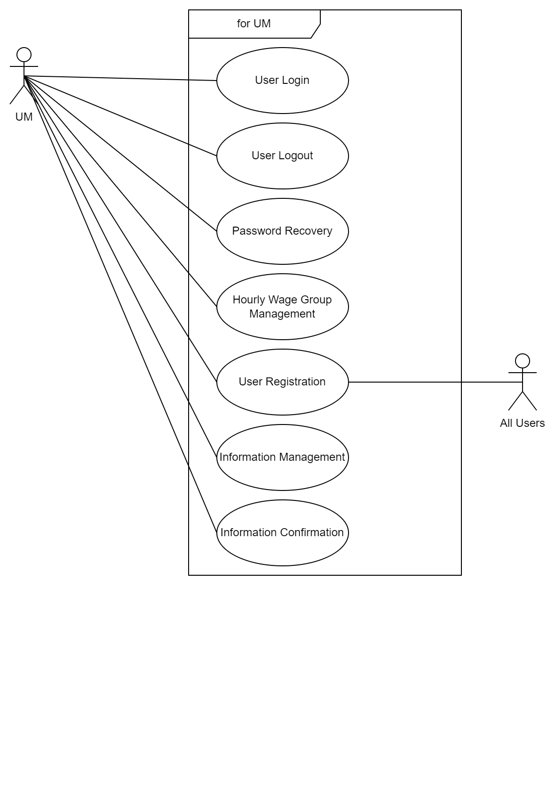
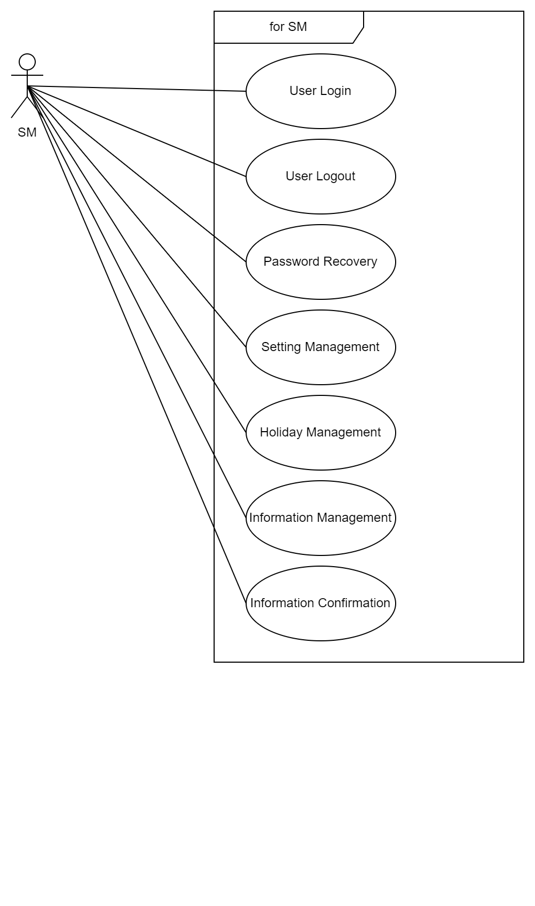
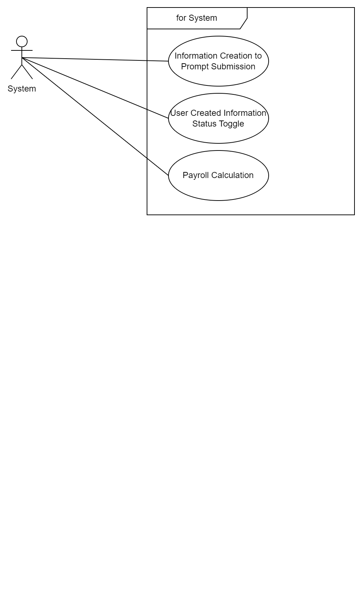

# UseCase<!-- omit in toc -->

- [Administrator](#administrator)
- [Attendance and Expense Registration(AER)](#attendance-and-expense-registrationaer)
- [Attendance Management(AM)](#attendance-managementam)
- [Finance Management(FM)](#finance-managementfm)
- [User Management(UM)](#user-managementum)
- [Setting Management(SM)](#setting-managementsm)
- [System](#system)

## Administrator

## Attendance and Expense Registration(AER)

## Attendance Management(AM)

## Finance Management(FM)

## User Management(UM)

## Setting Management(SM)

## System

